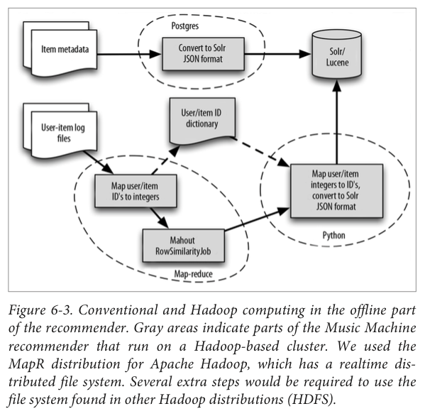
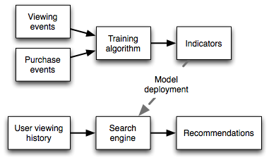

# Recomendação personalizada de vídeos e programas

## Problema

Recomendação de vídeos personalizada a partir do histórico de visualização de vídeos do usuário e dos metadados desses vídeos. A recomendação consiste em filtrar um conjunto de itens de maior relevância para um usuário.

Existem dois arquivos na pasta `data` com as seguintes informações:

- videos.csv: Contém uma linha para cada vídeo, com as seguintes colunas:
  - video_id: Id do vídeo
  - programa_id: Id do programa
  - programa_titulo: Título do programa
  - programa_descricao: Descrição do programa
  - categoria: Categoria do vídeo
  - titulo: Título do vídeotrain
  - descricao: Descrição do vídeo
  - tags: Tags do vídeo, separadas por ";"

- video_views.csv: Contém uma linha para cada par usuário/vídeo, com as seguintes colunas:
  - usuario_id: Id do usuário
  - video_id: Id do vídeo
  - porcentagem_vista: Porcentagem do vídeo vista pelo usuário. Valor é cumulativo e pode ser maior que um se usuário viu o vídeo mais de uma vez.
  - ultima_visualizacao: Timestamp da última vez que o usuário viu o vídeo

## Exploração inicial

No arquvo [data-exploration.md](data-exploration/data-exploration.md) está descrita a exploração inicial realizada nos dados crus. Foi a primeira etapa do processo, feita com o objetivo de entender como ele é distribuído e encontrar pistas sobre quais caminhos tomar.

Algumas conclusões tiradas a partir da exploração foram a respeito da proporção entre usuários e vídeos, a quantidade de vídeos assistida pela maior parte dos usuários e a diversidade na quantidade de pessoas que assistiram cada vídeo.

## Personalized Collaborative Filtering

Baseia-se em recomendações de produtos que a pessoa provavelmente gostará, baseadas no que pessoas semelhantes gostam. São guiadas pela forma como os ususário interagem com o sistema, além de suas preferências.

### Search-based Collaborative Recommendations

A proposta baseia-se principalmente em algoritmos de Collaborative Filtering do Apache Mahout, com o objetivo de treinar e criar um modelo de recomendações, somada à tecnologia de busca do ElasticSearch como deploy das recomendações.

Pontos que fundamentam a abordagem [[5]]:

* O comportamento dos usuários é a melhor pista para o que eles desejam;
* Co-ocorrência é o que permite ao Apache Mahout calcular indicadores significativos para o que deve ser recomendado;
* Existem semelhanças entre a ponderação dos escores dos indicadores nesses modelos e a matemática que fundamenta motores de recuperação de texto (como ElasticSearch);
* Tal similaridade matemática é o que permite explorar busca baseada em texto como deploy de um recomendador, como Mahout + Elasticsearch.

### User-based vs Item-based Collaborative Filtering

*User-based CF* localiza usuários com preferências similares ao usuário-alvo, e então agrega tais informações para tentar prever a preferência do usuário-alvo em relação a determinado item.
Já a abordagem *Item-based CF* localiza para cada item alguns itens similares, de acordo com a preferência dos usuários em relação a ele.

Algoritmos user-based precisam realizar muito do processamento no momento do request, já que relações entre usuários podem mudar rapidamente, e isso pode acarretar em um maior tempo de resposta do sistema. A abordagem item-based foi a escolhida por uma série de fatores: podem pré-computar e armazenar as similaridades com alguma antecedência, por isso é mais indicada para recomendações em tempo real. Além disso, a quantidade de itens tende a crescer em um rítmo menor que usuários, sendo também mais indicada em um cenário como o presente: quando a quantidade de itens é menor que a de usuários.

A preferência dos usuários em relação aos vídeos e programas será *implícita*, já que temos apenas a porcentagem de cada vídeo que foi visto.

## Arquitetura do sistema

A arquitetura foi inspirada no diagrama abaixo (Fonte: [PracticalMachineLearning.pdf]):

Porém algumas alterações no *flow* foram possíveis com a utilização do Apache Pig:

1. À medida que novos vídeos são criados e informações (como meta-dados) são editadas, um script trata de realizar o processamento necessário os dados, além de indexá-los ElasticSearch;
2. Dentro de janelas de tempo pré-definidas, o modelo pode ser treinado com base em novos logs de interação usuários-vídeos;
    3. Os logs são processados de acordo com a necessidade (regras de negócio podem ser alpicadas);
    4. ID's de usuários e itens são mapeadas para números inteiros utilizando um "dicionário";
    5. Mahout executa o modelo contra os dados, procurando similaridades entre itens que sirvam de indicadores para recomendação;
    6. ID's são traduzidas para seus valores originais;
    7. Indicadores encontrados pelo modelo são indexados no ElasticSearch.

> O Mahout aceita apenas ID's como inteiros por questões de performance ([Fonte](https://mahout.apache.org/users/recommender/intro-als-hadoop.html)).

### Entregando recomendações ao usuário (Search-based recommendations)

Buscas sobre as preferências de um dado usuário entre os indicadores de outros vídeos retornarão recomendações, na forma de listas de novos vídeos (ou programas) ordenados por relevância, de acordo com o gosto do usuário.

Dessa forma é possível personalizar as recomendações no momento da query, utilizando informações sobre o **contexto** do usuário (como por exemplo a categoria sendo vista ou geo-localização).

Utilizando um mecanismo de buscas para entregar recomendações contextualizadas, baseadas em similaridades pré-computadas, pode ser vista também da seguinte forma:

* Offline Machine Learning: o processamento intensivo é realizado "offline" (todas as noites, por exemplo).
* Online recommendations: rápida resposta do ElasticSearch oferece recomendações em tempo real, personalizadas pelo contexto ou histórico recente do usuário.

### Stack de tecnologias utilizadas

([Referência](http://occamsmachete.com/ml/2014/10/07/creating-a-unified-recommender-with-mahout-and-a-search-engine/))

### Collaborative Filtering com Mahout

É uma plataforma de recomendações open-source, que possui hoje uma comunidade ativa e pode ser aplicada em problemas de collaborative filtering, clustering e classification. Permite que as recomendações sejam avaliadas com base em Root Mean Squared Error (RMSE) e Mean Absolute Error (MAE), além de métricas como precisão, recall e fallout.

Algoritmos de similaridade do Mahout procuram por co-ocorrências como pistas para recomendação, mas para evitar o chamado *supermarket paradox* [[3]] e que recomendações não sejam dominadas por itens altamente populares, são identificadas apenas relações "interessantes". Itens altamente populares são menos interessantes nesse sentido, quando muitas pessoas demonstram preferência por determinado item ele é desconsiderado nas recomendações.

Por rodar com Spark, o Mahout tem poder de **computar documentos em paralelo**, de forma distribuída em um cluster, porém sem perder a flexibilidade de ser executado de forma *standalone* (em uma única máquina virtual).

### Spark

O Mahout já foi uma biblioteca de Machine Learning exclusiva para Hadoop, mas isso mudou. Novos engines de processamento paralelo, como *Spark*, estão ganhando destaque, ao ponto de um projeto como Mahout sofrer uma recente mudança de rumo, para que suporte também o *Spark* [[2]].

É um projeto open-source, de uma engine para processamento de dados em larga escala, de forma forma rápida e distribuída. É de certa forma uma solução "poliglota", as aplicações podem ser desenvolvidas em Java, Scala ou Python, além de acessar dados em HDFS, Cassandra, HBase e S3.

### Pig

Pig Latin foi utilizado para criar o *data flow*, desde a leitura dos logs, passando pela aplicação de possíveis regras de negócio, até a indexação no Elasticsearch (através do [es-hadoop](https://www.elastic.co/downloads/hadoop)).

Foi a opção escolhida pois é capaz de ler, analisar a processar grandes volumes de dados, de forma distribuída.

### ElasticSearch

É um mecanismo de buscas open-source baseado no [Apache Lucene](https://lucene.apache.org/core/). Armazena documentos compostos por campos, cada um com nome e conteúdo, que são indexados e podem ser encontrados através de buscas feitas por tais campos.

Junto aos metadados dos vídeos (e programas) serão indexados os indicadores computados pelos algoritmos do Mahout. Mecanismos como o ElasticSearch são otimizados para realizar buscas desse tipo, portanto será utilizado para encontrar as recomendações de acordo com o histórico do usuário [[4]].

Queries feitas para o ElasticSearch tornam simples a adição de filtros, como **regras de negócio**. Das recomendações entregues pelo EL serão excluídos vídeos já vistos pelo usuário, pois é desejado um alto nível de *novelty*, ou seja, recomendar itens ainda não vistos por ele, para que descubra novos conteúdos.

Quando comparado a outras opções populares (como [Apache Solr](http://lucene.apache.org/solr/)), o ElasticSearch se destaca principalmente por ter sido desenvolvido com a mentalidade de **processamento distribuído** desde o princípio. Quando executado em cluster, novos *nodes* podem ser incluídos e excluídos de acordo com a necessidade.

#### Dithering

Full-text search engines, como o ElasticSearch, ordenam documentos por relevância. Também permite que adicionemos variação no resultado das queries, através de [algumas funções](http://www.elastic.co/guide/en/elasticsearch/reference/current/query-dsl-function-score-query.html).

Incluir intencionalmente itens com baixa relevância nas listas de recomendações é uma técnica chamada de **dithering**, que tem o objetivo de manter renovados os dados do sistema. Como sistemas de recomendação coletam seus própios dados (Machine Learning), sem artifícios como este os dados de amanhã serão os mesmos de hoje, e ele não fará novas descobertas.

É uma técnica que prejudica levemente a performande do recomendador hoje, para evoluir seu conhecimento a respeito dos usuários e assim se aprimorar com o passar do tempo, portanto será utilizada.
([Fonte](https://www.mapr.com/products/mapr-sandbox-hadoop/tutorials/recommender-tutorial))

### Scripts

Alguns scripts foram necessários para um setup inicial dos documentos no ElasticSearch, portanto são executados uma única vez. Outros fazem parte do fluxo descrito na arquitetura do sistema, compondo os passos necessários para um novo treinamento dos modelos e re-indexação no ElasticSearch.

Uma descrição dos principais segue abaixo:

#### Setup inicial dos índices no EL

* [users_index.R](scripts/data-preparation/users_index.R): com base nos arquivos em `data/`, cria um CSV com meta-dados sobre os usuários: histórico de vídeos e programas vistos.
* [index_users_meta.pig](scripts/meta-data-index/index_users_meta.pig): indexa no EL o CSV produzido com meta-dados sobre os usuários.
* [index_show_meta.pig](scripts/meta-data-index/index_show_meta.pig): cria uma coleção de documentos chamda `shows` no EL, nela são indexados os programas com título e descrição.
* [index_video_meta.pig](scripts/meta-data-index/index_video_meta.pig): cria uma coleção chamada `videos` no EL, nela são indexados os vídeos com meta-dados.

> A tarefa executada pelo `index_users_meta.pig`, de indexar o histórico dos usuários, não existiria em um cenário ideal, quando essa informação viria provavelmente de um banco de dados.

#### Fluxo de treinamento dos modelos

O script [train.sh](scripts/train.sh) automatiza o processo de treinamento do modelo, com base em novos dados, e re-indexação do mecanismo de busca. As tarefas executados por ele estão documentadas no própio código.

## Escolha dos algoritmos

O Apache Mahout permite que diversos algoritmos sejam experimentados e testados, todos procuram identificar semelhanças entre usuários ou itens, porém com diferentes abordagens. O arquivo [mahout-evaluation.md](mahout-evaluation/mahout-evaluation.md) primeiramente mostra como foram pensados e obtidos os datasets utilizados nas avaliações, e por fim expõe os resultados obtidos, justificando as escolhas feitas.

## Utilizando o sistema

A arquitetura proposta pode ser implementada de forma distribuída, como dito anteriormente, porém é flexível ao ponto de rodar em uma única máquina virtual. O sistema operacional utilizado foi o [Ubuntu 14.04.2 LTS](http://www.ubuntu.com/about/about-ubuntu), open-source como os demais softwares que compõem o stack.

> Todos os scripts mencionados a seguir devem ser executados na raíz do projeto.

No script `install.sh` estão definidos os softwares que são dependências do sistema, ele foi utilizado na criação do ambiente e é útil para replicá-lo.

### Instalando o software

Tendo clonado este repositório, execute primeiro:

> `./scripts/install.sh`

Este comando irá automatizar o download e instalação de uma série de softwares utilizados no sistema.

### Indexando metadados

Os metadados referente aos usuários, vídeos e programas devem ser indexados no Elasticsearch. É um processo executado *uma única vez*, com o comando:

> `./scripts/setup.sh`

### Criando recomendações

Para treinar o modelo de recomendações, composto pelos algorirtmos do Mahout, e indexar os indicadores encontrados, utilize:

> `./scripts/train.sh`

Quando o processo finalizar, o ElasticSearch terá indexado os indicadores que formam a base para todas as recomendações. Sempre que `train.sh` for utilizado, **novos dados presente nos arquivos CSV serão utilizados pelos algoritmos**.

### Recomendações, na prática!

Para ter acesso à aplicação web em [http://localhost:4567](http://localhost:4567), inicie o servidor com:

> `./scripts/start.sh`

Nessa porta estará rodando a aplicação web que foi desenvolvida como protótipo, com o intuito de testar e experimentar na prática as recomendações.

A URL estruturada como `/usuário/_iddousuario_` permite simular o acesso às recomendações de qualquer usuário.

Uma motivação para o desenvolvimendo do protótipo foi testar queries com informações do *contexto* do usuário. Abaixo das principais recomendações na Home é possível ver recomendações divididas por categorias que ele demonstrou interesse, a query ao ElasticSearch utiliza o histórico do usuário porém atribui um maior peso à categoria.

A recomendação de vídeos similares (clicando em qualquer um dos vídeos) é feita utilizando as *tags* do item, dessa forma o mecanismo de busca pode encontrar os documentos similares mais relevantes. Portanto é uma recomendação do tipo *Content Filtered*, já que não utiliza qualquer informação a respeito do comportamento dos usuários.

Da mesma forma, a recomendação de programas similares utiliza o mecansmo de busca para encontrar os documentos mais relevantes de acordo com a descrição textual do programa selecionado.

#### Similaridades pré-computadas e "cold start"

No protótipo o histórico da navegação é acumulado através de *cookies*, dessa forma é possível acessar os vídeos e simular um ambiente "vivo".

A abordagem de pré-computar e armazenar as similaridades entre os itens do sistema é ideial para recomendações em tempo real, pois o processamento é antecipado e dessa forma não interfere na experiência do usuário com o produto.

É preciso encontrar uma forma de entregar recomendações também aos usuários que acessam pela primeira vez o sistema. Quando as similaridades são *user-based*, é preciso que as preferências do usuário estejam presente no treinamento do modelo, e por esse motivo é possível observar uma situação conhecida como **"cold start"**, quando não é possível encontrar recomendações relevantes.

Similaridades *item-based* podem ser pré-computadas, dessa forma permitem que sejam entregues recomendações relevantes apesar de que nenhuma informação a respeito do usuário existia no momento do treinamento.

## Problemas conhecidos

Na implementação atual os scripts acabam lendo e escrevendo arquivos em disco, o que é um processo demorado e pode ser um sério problema com maiores volumes de dados. Talvez seja indispensável utilizar algo como  [HDFS](https://hadoop.apache.org/docs/r1.2.1/hdfs_design.html), ou pesquisar melhores formas de lidar como essa situação.

Possíveis experimentos:

* Diversificar as recomendações: para que não se repitam com tanta frequência;
* Utilizar nas queries apenas o histórico recente do usuário: porém utilizar o histórico completo no treinamento do modelo.

[1]: https://www.mapr.com/blog/inside-look-at-components-of-recommendation-engine
[2]: https://www.mapr.com/blog/mahout-spark-what%E2%80%99s-new-recommenders
[3]: http://spectrum.ieee.org/computing/software/deconstructing-recommender-systems
[4]: https://www.mapr.com/products/mapr-sandbox-hadoop/tutorials/recommender-tutorial
[PracticalMachineLearning.pdf]: http://info.mapr.com/rs/mapr/images/PracticalMachineLearning.pdf
