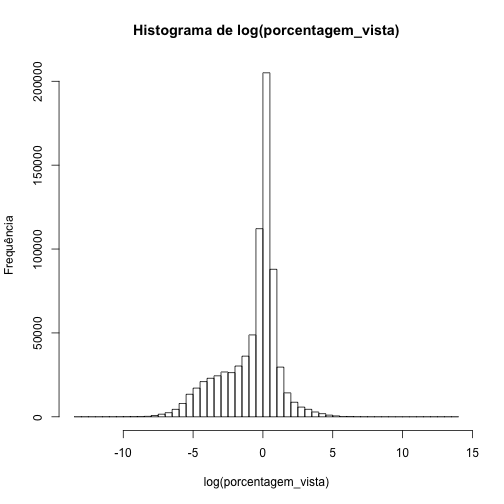
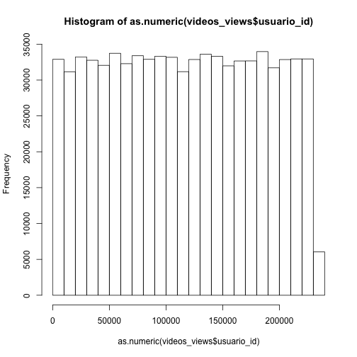
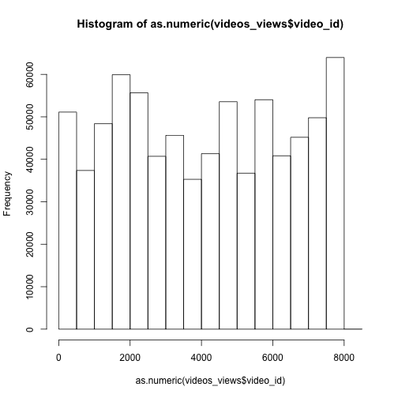
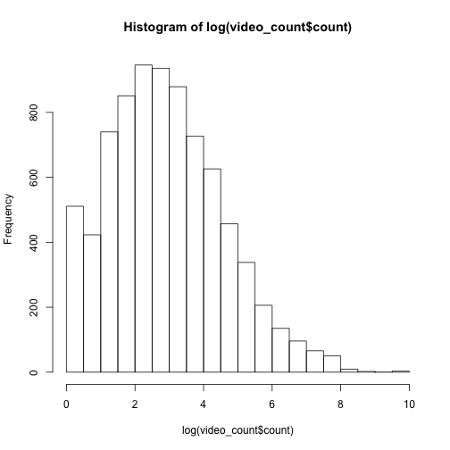
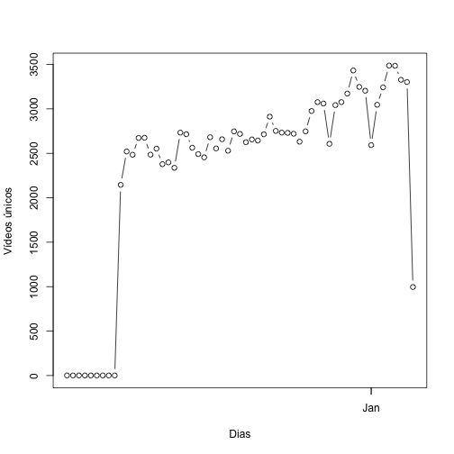
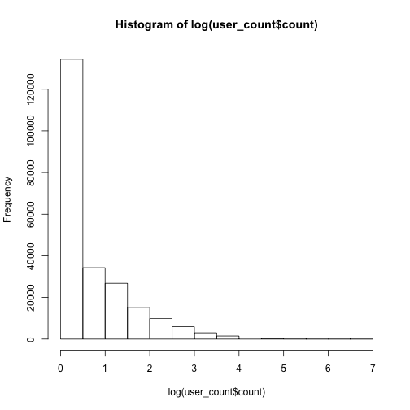
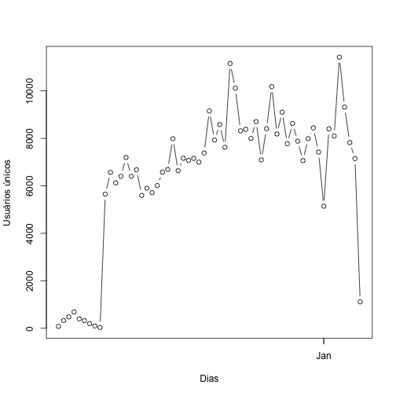
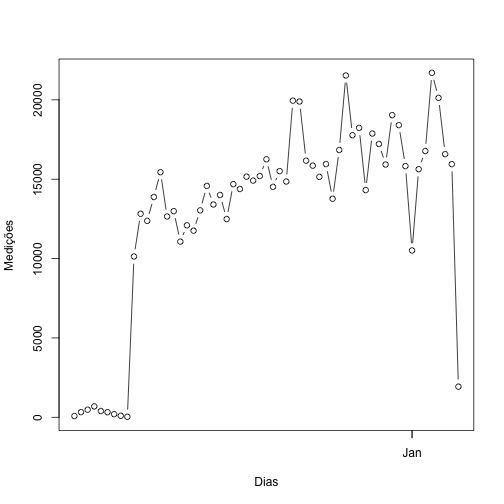

Importando pacotes necessários:


```r
library(dplyr)
library(ineq)
```

Lendo dados crus para iniciar os trabalhos:


```r
videos_views <- read.csv(file = '../data/video_views.csv', header = TRUE)
videos_views$ultima_visualizacao <- 
        as.POSIXct(videos_views$ultima_visualizacao / 1000, 
                   origin = "1970-01-01")
videos_views <- tbl_df(videos_views)
asc_by_date <- arrange(videos_views, ultima_visualizacao)
```

Em uma análise inicial dos dados, chamam a atenção leituras negativas para a
*porcentagem vista*:


```r
summary(videos_views)
```

```
##             usuario_id                 video_id      porcentagem_vista  
##  cbe216be274d1222:   684   36e23f3aee64080b: 15435   Min.   :-993339.1  
##  34951210245a8a16:   274   f6c97d465812cd95: 14341   1st Qu.:      0.2  
##  8bb79cba08ec84a8:   274   4445b1df3f3fb271: 13805   Median :      1.0  
##  289f8daa307b5952:   214   9a689d69e265943f:  7459   Mean   :      3.7  
##  a2665a0764efa819:   212   02393577a696fda6:  6225   3rd Qu.:      1.5  
##  099b3d953e3bc688:   208   b974dc6084f2e445:  4718   Max.   : 975493.7  
##  (Other)         :757882   (Other)         :697765                      
##  ultima_visualizacao          
##  Min.   :2014-11-10 22:34:04  
##  1st Qu.:2014-12-03 22:12:48  
##  Median :2014-12-15 21:44:34  
##  Mean   :2014-12-15 10:01:30  
##  3rd Qu.:2014-12-27 09:13:37  
##  Max.   :2015-01-07 14:26:05  
## 
```

Sendo uma indicação da porcentagem do vídeo vista pelo usuário, opto por tratar
como *erros de leitura*. Excluindo porcentagens negativas:


```r
videos_views <- filter(videos_views, porcentagem_vista >= 0)
```

Observando a distribuição de frequência da *porcentagem vista*, em escala 
logarítmica, vemos que a maior concentração de vídeos possui porcentagem de 
vistualização igual a (ou muito próximo de) 1:


```r
hist(log(videos_views$porcentagem_vista), 
     breaks = 50, 
     main = 'Histograma de log(porcentagem_vista)', 
     xlab = 'log(porcentagem_vista)', 
     ylab = 'Frequência')
```

 

Nota-se que a distribuição de usuários é bastante equilibrada:


```r
hist(as.numeric(videos_views$usuario_id))
```

 

Já a distribuição dos vídeos nem tanto, porém mantêm relativo equilíbrio:


```r
hist(as.numeric(videos_views$video_id))
```

 

Vídeos ordenados pela frequência:


```r
video_count <- group_by(videos_views, video_id) %>% 
        summarise(count = n()) %>%
        arrange(desc(count))
summary(video_count)
```

```
##              video_id        count         
##  001abe1fc1547c4d:   1   Min.   :    1.00  
##  002575e0f4198f5a:   1   1st Qu.:    5.00  
##  00283dfbeeab94fc:   1   Median :   17.00  
##  002f93c111fb2ecc:   1   Mean   :   94.93  
##  0037f8665e3ca35b:   1   3rd Qu.:   54.00  
##  003d569418536241:   1   Max.   :15426.00  
##  (Other)         :7995
```

Como mostra a tabela anterior, a distribuição dos vídeos é maior 
em torno de 15:


```r
hist(log(video_count$count), breaks = 20)
```

 

Quantidade de vídeos únicos por dia:


```r
qty_video_by_day <- asc_by_date
qty_video_by_day$day <- 
        as.character(round(qty_video_by_day$ultima_visualizacao, "day"))
qty_video_by_day <- group_by(qty_video_by_day, day) %>% 
        summarise(count = n_distinct(video_id))
qty_video_by_day$day <- as.POSIXct(qty_video_by_day$day)
plot(qty_video_by_day$day, qty_video_by_day$count,
     type = 'b', 
     xlab = 'Dias', ylab = 'Vídeos únicos')
```

 

Usuários ordenados pela frequência:


```r
user_count <- group_by(videos_views, usuario_id) %>% 
        summarise(count = n()) %>%
        arrange(desc(count))
summary(user_count)
```

```
##             usuario_id         count        
##  00001583191e1a2b:     1   Min.   :  1.000  
##  0000335b3fb14caa:     1   1st Qu.:  1.000  
##  0000adcad7b79817:     1   Median :  1.000  
##  0000e4d1f84512a2:     1   Mean   :  3.278  
##  0001776fb62db699:     1   3rd Qu.:  3.000  
##  0001c8dc8dc7723f:     1   Max.   :683.000  
##  (Other)         :231725
```

Podemos ver que, em média, cada usuário assistiu a 
3.2776797 vídeos.

Ilustrando o que a tabela anterior mostrou, vemos que a grande maioria dos 
usuários assistiu a apenas um vídeo:


```r
hist(log(user_count$count), breaks = 20)
```

 

Mais precisamente, 
58.0120916 %
assitiu a apenas um vídeo.

Quantidade de usuários únicos por dia:


```r
qty_user_by_day <- asc_by_date
qty_user_by_day$day <- 
        as.character(round(qty_user_by_day$ultima_visualizacao, "day"))
qty_user_by_day <- group_by(qty_user_by_day, day) %>% 
        summarise(count = n_distinct(usuario_id))
qty_user_by_day$day <- as.POSIXct(qty_user_by_day$day)
plot(qty_user_by_day$day, qty_user_by_day$count,
     type = 'b', 
     xlab = 'Dias', ylab = 'Usuários únicos')
```

 

Dividindo os dados em porções de 25%, vemos como se apresenta a 
quantidade de vídeos e usuários, respectivamente:


```r
quantile(video_count$count, probs = seq(0, 1, 0.25))
```

```
##    0%   25%   50%   75%  100% 
##     1     5    17    54 15426
```

```r
quantile(user_count$count, probs = seq(0, 1, 0.25))
```

```
##   0%  25%  50%  75% 100% 
##    1    1    1    3  683
```

Quantidade total de medições distribuídas por dia:


```r
qty_by_day <- asc_by_date
qty_by_day$day <- as.character(round(qty_by_day$ultima_visualizacao, "day"))
qty_by_day <- group_by(qty_by_day, day) %>% summarise(count = n())
qty_by_day$day <- as.POSIXct(qty_by_day$day)
plot(qty_by_day$day, qty_by_day$count, 
     type = 'b', 
     xlab = 'Dias', ylab = 'Medições')
```

 

Gini Index usando a quantidade de usuários que assistiram cada vídeo:


```r
incr_prop <- group_by(videos_views, video_id) %>% 
        summarise(count = n_distinct(usuario_id))
Gini(incr_prop$count)
```

```
## [1] 0.8149035
```

Está próximo a 1, indicando que a quantidade de pessoas que assistiram aos 
vídeos é bastante diversificada. Um Gini Index igual a 1 significaria que 
todos os vídeos foram assistidos por um quantidade diferente de pessoas. 
Igual a 0 significaria que a quantidade de pessoas que assistiram aos vídeos 
é igualmente distribuída.

Proporção usuários/videos:


```r
nrow(distinct(videos_views, usuario_id)) / nrow(distinct(videos_views, video_id))
```

```
## [1] 28.96275
```
