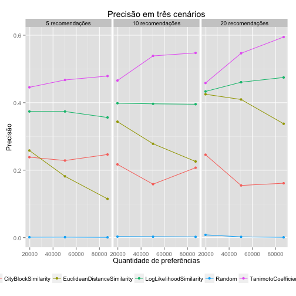
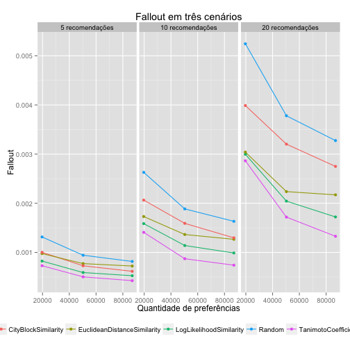
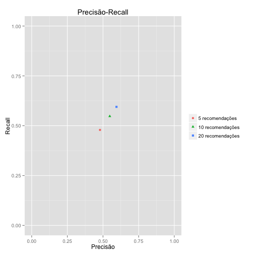
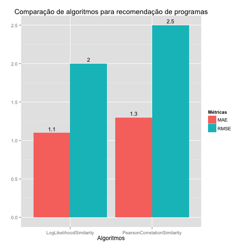

# Preparação de dados para avaliação dos algoritmos

Para avaliar a performance nas recomendações, foi feita uma avaliação dos
algoritmos disponíveis no Mahout, com o objetivo de também compará-los.

O seguinte relatório mostra inicialmente como foram obtidas as 
amostras utilizadas.


```r
library(dplyr)
library(ggplot2)
```

Serão avalidas as recomendações de vídeos e de programas, iniciando 
pela primeira.

## Recomendação de vídeos

Função para impressão dos arquivos CSV:


```r
clear_and_write <- function(df, name) {
        
        # Mahout espera que ID's sejam numéricas
        df$usuario_id <- as.integer(df$usuario_id)
        df$video_id <- as.integer(df$video_id)
        
        df <- select(df, usuario_id, video_id, porcentagem_vista)
        write.table(df, file = name, sep = ',',
                    row.names = FALSE, quote = FALSE, col.names = FALSE)
}
```

Lendo dados crus e removendo leituras negativas:


```r
videos_views <- read.csv(file = '../data/video_views.csv', header = TRUE)
videos_views <- tbl_df(videos_views) %>% select(1:3)
videos_views <- filter(videos_views, porcentagem_vista >= 0)

videos <- read.csv(file = '../data/videos.csv', header = TRUE)
videos <- tbl_df(videos)
```

Vídeos com a porcentagem vista de pelo menos 50% serão considerados *vistos*:


```r
videos_views$visto <- as.integer(videos_views$porcentagem_vista > 0.5)
```

Agrupando vídeos e usuários para somar quantidade de visualizações:


```r
video_count <- group_by(videos_views, video_id) %>% summarise(count = n())
user_count <- group_by(videos_views, usuario_id) %>% summarise(count = n())
```

A menor amostra é composta por vídeos vistos por 1 a 20 usuários:


```r
video_sample <- filter(video_count, count >= 1 & count <= 20) %>% 
        sample_frac(1.00) %>% 
        select(video_id)
videos_1_20 <- filter(videos_views, 
                      video_id %in% video_sample$video_id & 
                              visto == TRUE)
clear_and_write(videos_1_20, 'videos_1_20.csv')
```

Uma amostra intermediária é composta por vídeos vistos por 1 a 50 usuários:


```r
video_sample <- filter(video_count, count >= 1 & count <= 50) %>% 
        sample_frac(1.00) %>% 
        select(video_id)
videos_1_50 <- filter(videos_views, 
                      video_id %in% video_sample$video_id & 
                              visto == TRUE)
clear_and_write(videos_1_50, 'videos_1_50.csv')
```

Por fim, a maior amostra é composta por vídeos vistos por 1 a 100 usuários:


```r
video_sample <- filter(video_count, count >= 1 & count <= 100) %>% 
        sample_frac(1.00) %>% 
        select(video_id)
videos_1_100 <- filter(videos_views, 
                       video_id %in% video_sample$video_id & 
                               visto == TRUE)
clear_and_write(videos_1_100, 'videos_1_100.csv')
```

Para a comparação dos algoritmos quanto à recomendação de vídeos, estes foram 
os data sets utilizados:


```r
ds_table <- data.frame(matrix(nrow = 3, ncol = 4))
names(ds_table) <- c('Data Set', 'Preferências', 'Usuários', 'Itens')

ds_table[1, 1] <- '1 a 20'
ds_table[1, 2] <- nrow(videos_1_20)
ds_table[1, 3] <- nrow(distinct(videos_1_20, usuario_id))
ds_table[1, 4] <- nrow(distinct(videos_1_20, video_id))

ds_table[2, 1] <- '1 a 50'
ds_table[2, 2] <- nrow(videos_1_50)
ds_table[2, 3] <- nrow(distinct(videos_1_50, usuario_id))
ds_table[2, 4] <- nrow(distinct(videos_1_50, video_id))

ds_table[3, 1] <- '1 a 100'
ds_table[3, 2] <- nrow(videos_1_100)
ds_table[3, 3] <- nrow(distinct(videos_1_100, usuario_id))
ds_table[3, 4] <- nrow(distinct(videos_1_100, video_id))

ds_table
```

```
##   Data Set Preferências Usuários Itens
## 1   1 a 20        19656     8109  3802
## 2   1 a 50        50325    17533  5298
## 3  1 a 100        87002    27805  6120
```

### Comparação dos algoritmos

A avaliação dos algoritmos foi realizada com o próprio Mahout, executando 
suas classes de avaliação em uma única máquina virtual. O método utilizado por 
ele é o *Leave one out*, que de uma simplificada funciona da seguinte forma:

1. É removida uma preferência do usuário
2. O modelo é criado com o restante
3. O item foi recomendado ou não?

Como os vídeos serão considerados *vistos/não vistos*, participaram da 
avaliação todos os algoritmos indicados para relações binárias 
entre usuário/item (além de recomendações randômicas, apenas para 
fins de comparação):

* LogLikelihoodSimilarity
* EuclideanDistanceSimilarity
* CityBlockSimilarity
* TanimotoCoefficientSimilarity
* Random

Foram obtidas estatísticas de performance como precisão e recall, contra as 
três amostras selecionadas anteriormente e em três cenários: 

* 5 itens recomendados
* 10 itens recomendados
* 20 itens recomendados

Os resultados são lidos:


```r
evaluation <- read.csv('mahout-evaluation-videos.csv', header = TRUE)
evaluation[evaluation$sample == '1_20', 'preferences'] <- ds_table[1,2]
evaluation[evaluation$sample == '1_50', 'preferences'] <- ds_table[2,2]
evaluation[evaluation$sample == '1_100', 'preferences'] <- ds_table[3,2]

evaluation$at <- factor(evaluation$at)
levels(evaluation$at) <- c('5 recomendações', 
                           '10 recomendações', 
                           '20 recomendações')
```

Calculando F-score:


```r
evaluation <- mutate(evaluation, fscore = 2 * 
                             (precision * recall) / (precision + recall))
```

A precisão é a probabilidade de que um item recomendado corresponde às 
preferências do usuário. O gráfico a seguir mostra como as opções se 
comportaram em relação à precisão nos três cenários:


```r
ggplot(data = evaluation,
       aes(x = preferences, y = precision, group = algorithm, 
           colour = algorithm)) + 
        geom_line() +
        geom_point() + 
        facet_grid(.~at) + 
        theme(legend.position = 'bottom', legend.title = element_blank()) + 
        ylab('Precisão') + 
        xlab('Quantidade de preferências') + 
        ggtitle('Precisão em três cenários')
```

 

Em todos os cenários, o algoritmo de similaridade baseado no 
*Coeficiente de Tanimoto* mostrou-se como a opção mais precisa. 
Sua precisão foi crescente a medida que a quantidade de dados aumentou, 
apresentando apenas uma leve redução de crescimento quando avaliado na 
maior amostra.

Como os itens nesse contexto são vídeos, é importante notar que 
falsos-positivos podem ser super-estimados, já que vídeos nunca antes vistos 
podem representar vídeos que o usuário simplesmente não conhece.

Interesante notar que o algoritmo *LogLikelihoodSimilarity* mostrou precisão 
quase constante no cenário de 10 recomendações, merecendo talvez uma melhor 
investigação em futuros testes.

O *TanimotoCoefficientSimilarity* funciona de uma forma relativamente simples:
Supondo que existam U usuários e T vídeos, cada usúario ou assistiu (1) ou não 
assistiu (0) um dado vídeo. Assim temos vetores T de 1s e 0s, representando a 
preferência de cada usúario em relação ao vídeo. É possível comparar quaisquer 
dois vetores T, Ti e Tj computando:
**(interseção entre Ti Tj) / (união entre Ti Tj)**
O resultado é um número entre 0 e 1, representando o quão frequente usuários 
assistem aos dois vídeos, ou seja, o quão similares são.

A métrica de Fallout é comparada no gráfico a seguir. É a proporção entre 
os vídeos recomendados erroneamente (FP) e todos os vídeos 
que ele nunca assistiu (FP + TN), ou seja, a probabilidade de que um item 
irrelevante será recomendado:


```r
ggplot(data = evaluation,
       aes(x = preferences, y = fallout, group = algorithm, 
           colour = algorithm)) + 
        geom_line() +
        geom_point() + 
        facet_grid(.~at) + 
        theme(legend.position = 'bottom', legend.title = element_blank()) + 
        ylab('Fallout') + 
        xlab('Quantidade de preferências') + 
        ggtitle('Fallout em três cenários')
```

 

A relação Precisão/Recall é melhor quanto mais próxima de 1, e comparando os 
três cenários na maior amostra utilizada, com o algoritmo 
*TanimotoCoefficientSimilarity*, obtemos o seguinte gráfico:


```r
pr_data <- filter(evaluation, algorithm == 'TanimotoCoefficientSimilarity' & 
                          sample == '1_100')
ggplot(pr_data, aes(x = precision, y = recall)) + 
        geom_point(aes(shape = factor(at), color = factor(at))) + 
        scale_y_continuous(limits = c(0, 1)) + 
        scale_x_continuous(limits = c(0, 1)) + 
        ylab('Recall') + 
        xlab('Precisão') + 
        ggtitle('Precisão-Recall') + 
        theme(legend.title = element_blank())
```

 

Podemos ver, de uma outra forma, como o cenário de 20 recomendações é o que 
traz maior precisão e recall, chegando mais próximo de 1 em ambas métricas.

## Recomendação de programas

Para testar a recomendação de programas a abordagem foi um pouco diferente, 
dada a quantidade de vídeos que um programa pode ter.
Se para os vídeos a relação foi assumida como *binária* (visto/não visto), 
a preferência em relação aos programas foi expressada da seguinte forma:

Para um usuário U e programa I:
(QTD de vídeos assistidos em I / total de vídeos em I) * 10

Arredondando o resultado obtido, temos uma escala de 0 a 10, sendo 10 quando 
o usuário U assitiu a todos os vídeos do programa I.

Join entre as tabelas para obter a ID do programa:


```r
merged <- merge(videos_views, videos, by = 'video_id')
merged <- tbl_df(merged)
```

Calculando a quantidade total de vídeos em cada programa:


```r
qty_by_show <- group_by(merged, programa_id) %>% 
        summarise(total = n_distinct(video_id))
```

Quantidade de vídeos assistidos por usuário em cada programa:


```r
grouped <- group_by(merged, usuario_id, programa_id) %>% 
        summarise(count = n())
```

Mesclando as duas tabelas para calcular a preferência usuário-programa
(conforme descrito acima):


```r
grouped <- merge(grouped, qty_by_show, by = 'programa_id')
grouped <- tbl_df(grouped)

grouped <- mutate(grouped, preference = as.integer(count / total * 10)) %>% 
        select(programa_id, usuario_id, preference) %>%
        transmute(usuario_id = usuario_id, 
                  programa_id = programa_id, preference = preference)
```

CSV utilizado no benchmark de algoritmos:


```r
grouped$usuario_id <- as.integer(grouped$usuario_id)
grouped$programa_id <- as.integer(grouped$programa_id)

write.table(grouped, file = 'users_shows.csv', sep = ',',
            row.names = FALSE, quote = FALSE, col.names = FALSE)
```

### Comparação dos algoritmos

Para mensurar a precisão das previsões feitas por cada algoritmo, duas 
métricas foram utilizadas:

* Root Mean Squared Error (RMSE)
* Mean Absolute Error (MAE)

*RMSE* é uma métrica muito popular na análise de sistemas de recomendação. 
Sabendo de ante-mão a preferência dos usuários quanto a determinados items, 
o sistema realiza previsões as compara com os números reais.
Sua principal diferença em relação a *MAE* é que penaliza desproporcionalmente 
grandes erros.

Utilizando todos os dados disponíveis, o gráfico abaixo mostra como os 
dois algoritmos escolhidos se comportaram:


```r
evaluation <- read.csv('mahout-evaluation-shows.csv', header = TRUE)
ggplot(evaluation, aes(x = factor(algorithm), y = value, 
                       fill = factor(metric)), color = factor(metric)) + 
        geom_bar(stat = 'identity', position=position_dodge()) + 
        ylab('') + 
        xlab('Algoritmos') + 
        ggtitle('Comparação de algoritmos para recomendação de programas') + 
        scale_fill_discrete(name = 'Métricas') + 
        geom_text(aes(y = value, ymax = value, label = round(value, 2)), size = 4, 
                  position = position_dodge(width = 0.9), 
                  vjust = -.5, 
                  color = 'black')
```

 

*LogLikelihoodSimilarity* e *PearsonCorrelationSimilarity* obtiveram um MAE 
muito semelhante, errando em média pouco mais de 1 unidade na escala de 1 a 10 
quanto à preferência em relação aos programas. Porém *LogLikelihoodSimilarity* 
se mostrou superior quando analisada a RMSE, não tendo cometido erros 
desproporcionalmente grandes.
